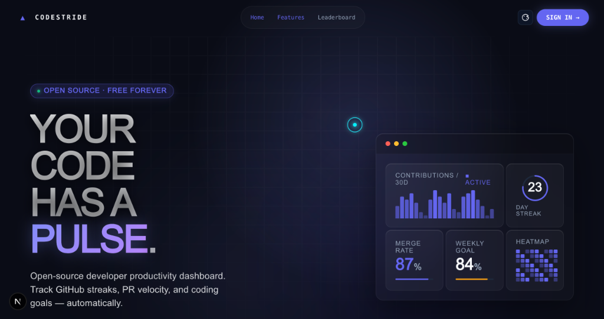
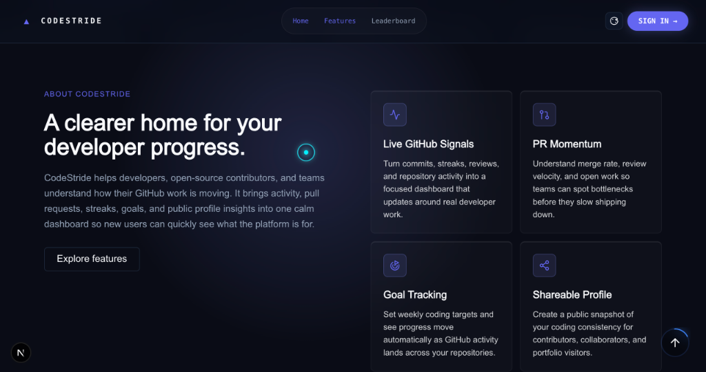
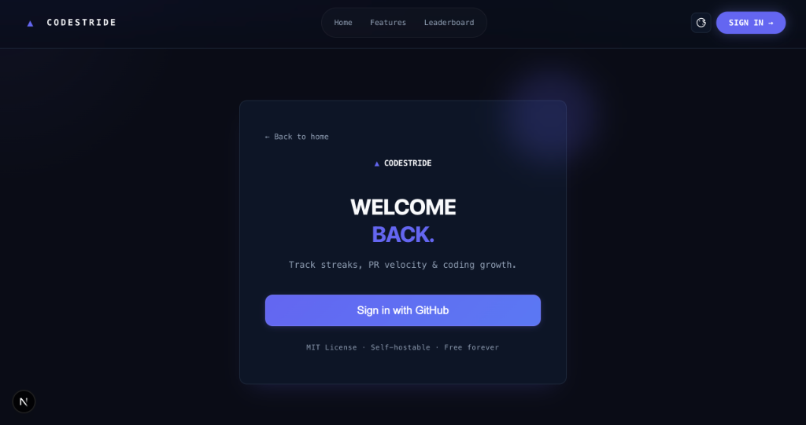

<div align="center">

# ⚡ CodeStride

**Your developer productivity command center.**

Track your GitHub activity, commit streaks, PR analytics, and coding goals in one clean, self-hostable dashboard — zero vendor lock-in, free forever.

[](https://github.com/omen18/CodeStride/actions/workflows/ci.yml)
[](./LICENSE)
[](./CONTRIBUTING.md)
[](./DEVELOPMENT.md)
[](https://github.com/omen18/CodeStride/stargazers)

<br />

**[Live Demo](https://codestride.vercel.app)** · **[Quick Start](#-getting-started)** · **[Report Bug](https://github.com/omen18/CodeStride/issues/new?template=bug_report.yml)** · **[Request Feature](https://github.com/omen18/CodeStride/issues/new?template=feature_request.yml)**

<br />

</div>

---

## 📸 Visual Showcase

<div align="center">

### 1. Developer Productivity Dashboard


*Real-time commit heatmaps, rolling 30-day activity, 23-day streak tracker, PR merge rates, and weekly progress goals.*

<br />

### 2. Feature & Analytics Signals


*Live GitHub signals, pull request momentum, automated goal tracking, and shareable developer profiles.*

<br />

### 3. GitHub OAuth Authentication


*One-click GitHub OAuth authentication — secure, fast, and completely self-hostable.*

</div>

---

## ✨ Features

- ⚡ **Commit Streak Tracker**: Keep your coding momentum alive with current streaks, longest streaks, and active day counts.
- 📊 **PR Momentum Analytics**: Track review response times, merge rates, and open vs. closed pull request counts.
- 🎯 **Automated Goal Tracking**: Set weekly coding goals that auto-update as commits land across your GitHub repositories.
- 🌐 **Public Developer Profile**: Share your coding journey at `/u/[username]` with customizable badges and repo spotlights.
- 🏆 **GitHub Achievements Sync**: Automatically sync GitHub achievement badges directly to your profile.
- 🎨 **Multi-Theme Palette**: Built-in Obsidian Dark, Modern Light, Nordic Slate, and Cyberpunk Velvet themes.
- 🔒 **Self-Hostable & Private**: Fully open-source with Next.js 16 + Supabase — keep 100% control of your data.

---

## 🛠️ Tech Stack

| Layer | Technology |
|---|---|
| **Framework** | Next.js 16 (App Router, Turbopack) |
| **Language** | TypeScript 5 |
| **Styling** | Tailwind CSS + Vanilla CSS Variables |
| **Database & Auth** | Supabase (PostgreSQL + RLS) & NextAuth.js |
| **Charts** | Recharts |
| **Icons & Motion** | Lucide React + Tailwind Animations |
| **Deployment** | Vercel (Free tier ready) |

---

## 🚀 Getting Started

### 1. Clone & Install

```bash
git clone https://github.com/omen18/CodeStride.git
cd CodeStride
npm install --ignore-scripts
```

### 2. Configure Environment

Copy `.env.example` to `.env.local` and add your Supabase and GitHub OAuth keys:

```bash
cp .env.example .env.local
```

### Environment Variables

| Variable | Required | Description |
|---|---|---|
| `NEXT_PUBLIC_SUPABASE_URL` | Yes | Supabase Project URL |
| `NEXT_PUBLIC_SUPABASE_ANON_KEY` | Yes | Supabase Anon Public Key |
| `SUPABASE_SERVICE_ROLE_KEY` | Yes | Supabase Service Role Key (Server-only) |
| `NEXTAUTH_URL` | Yes | App Base URL (`http://localhost:3000` locally) |
| `NEXTAUTH_SECRET` | Yes | Session encryption key (`openssl rand -base64 32`) |
| `GITHUB_ID` | Yes | GitHub OAuth App Client ID |
| `GITHUB_SECRET` | Yes | GitHub OAuth App Client Secret |
| `ENCRYPTION_KEY` | Yes | 32-byte hex encryption key (`openssl rand -hex 32`) |

### 3. Run Development Server

```bash
npm run dev
```

Open [http://localhost:3000](http://localhost:3000) in your browser.

---

## 📂 Project Structure

```text
CodeStride/
├── src/
│   ├── app/                 # Next.js 16 App Router pages & API routes
│   ├── components/          # Reusable UI components & dashboard widgets
│   ├── lib/                 # Auth, Supabase, theme & GitHub API helpers
│   └── styles/              # Global CSS & design system tokens
├── public/
│   ├── assets/screenshots/  # Visual showcase screenshots
│   └── openapi.yaml         # REST API Specification
├── supabase/                # PostgreSQL schema migrations
├── test/                    # Unit test suite
└── e2e/                     # Playwright E2E test suite
```

---

## 📜 License & Maintainer

Distributed under the **MIT License**. See [`LICENSE`](./LICENSE) for details.

Developed & Maintained by **[Yash Raj Sharan](https://github.com/omen18)** (`@omen18`).

